# 基于 VirtualBox 的网络攻防基础环境搭建

## 实验目的
- 掌握 VirtualBox 虚拟机的安装与使用；
- 掌握 VirtualBox 的虚拟网络类型和按需配置；
- 掌握 VirtualBox 的虚拟硬盘多重加载；

## 实验环境
- VirtualBox 虚拟机
- 攻击者主机（Attacker）：Kali Rolling 2019.2
- 网关（Gateway, GW）：Debian Buster
- 靶机（Victim）：From Sqli to shell / xp-sp3 / Kali
  
## 实验要求
1. 虚拟硬盘配置成多重加载；
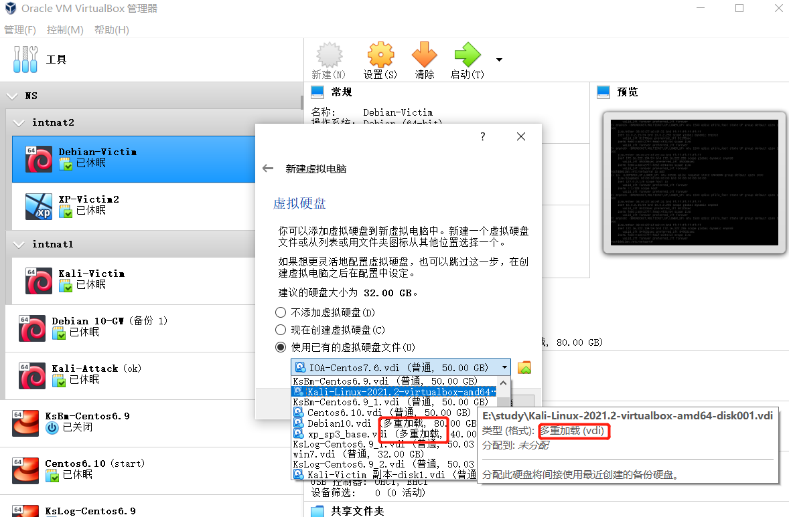

2. 搭建满足如下拓扑图所示的虚拟机网络拓扑：
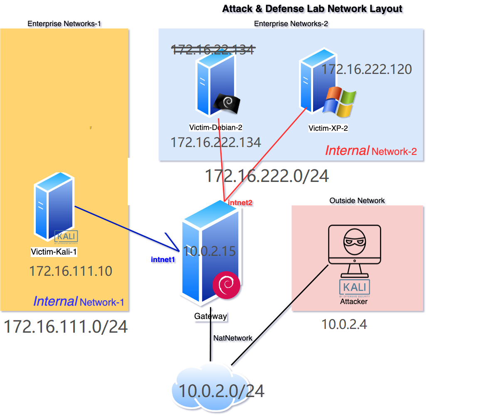

3. 完成以下网络连通性测试；
[√] 靶机可以直接访问攻击者主机
[√] 攻击者主机无法直接访问靶机
[√] 网关可以直接访问攻击者主机和靶机
[√] 靶机的所有对外上下行流量必须经过网关
[√] 所有节点均可以访问互联网

## 实验过程

### 多重加载与网络拓扑建立：


- |              网关配置               |      IP      |
  | :---------------------------------: | :----------: |
  |           NAT      |   10.0.2.15   |
  |      intnet1       | 172.16.111.1 |
  |       intnet2      | 172.16.222.1 |

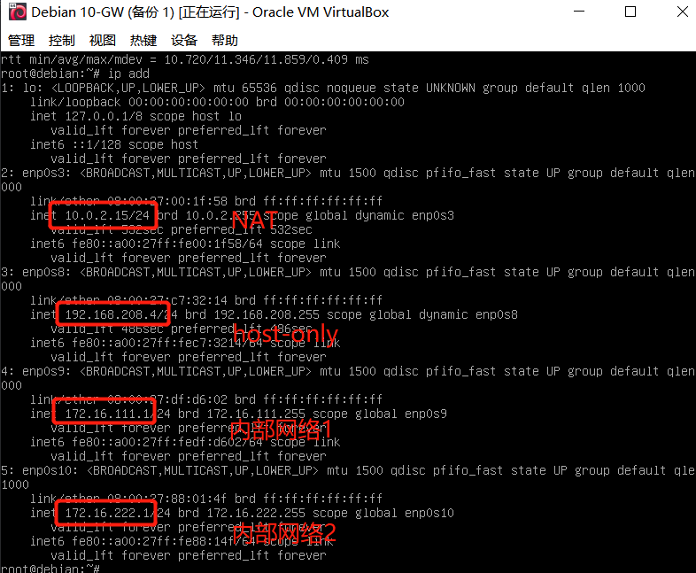
  
  

- |   hostname    |       IP       |
  | :-----------: | :------------: |
  | kali-attacker |   10.0.2.4   |
  |   xp-victim  | 172.16.222.120 |
  |  debian-victim   | 172.16.222.134 |
  |  kali-victim  | 172.16.111.10 |

- |   host-only   |       IP       |
  | :-----------: | :------------: |
  |   kali-attacker  | 192.168.27.20 |
  | debian-gateway   | 192.168.208.4 |


### 网络连通性测试；


-[√] 靶机可以直接访问攻击者主机-

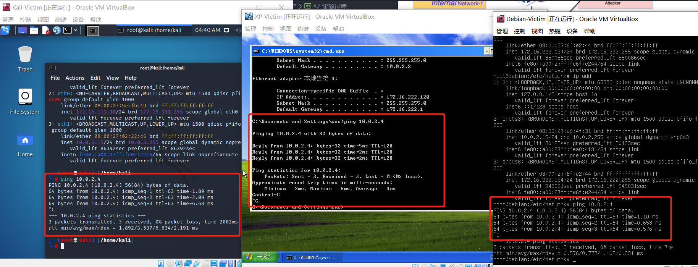


-[√] 攻击者主机无法直接访问靶机-
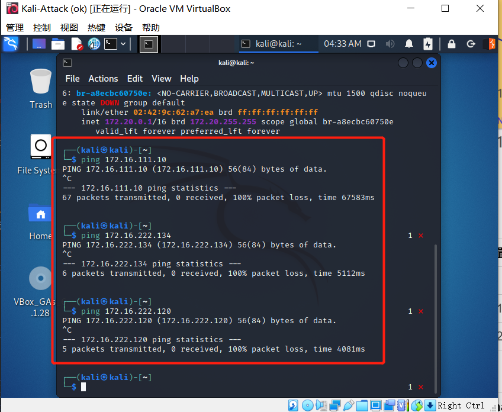

-[√] 网关可以直接访问攻击者主机和靶机-
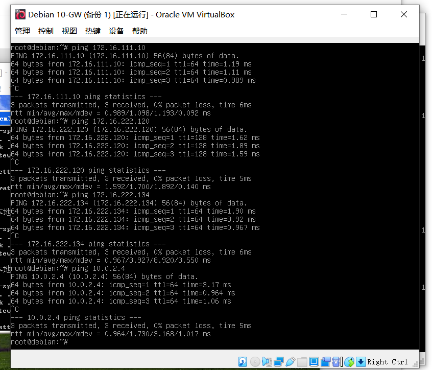

-[√] 靶机的所有对外上下行流量必须经过网关-

通过查看dns日志，或者安装tcpdunmp监听指定网卡：

`tail -F /var/log/dnsmasq.log`查看dns日志

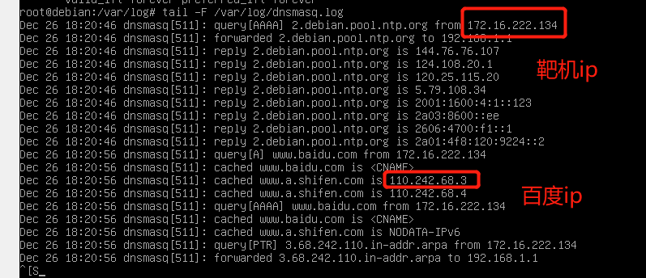
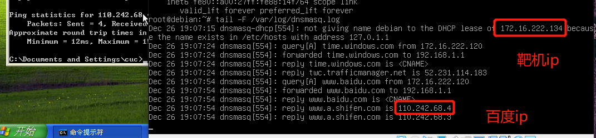

```
apt-get install tcpdump
tcpdump -i enp039 -n
```
监听网卡9：

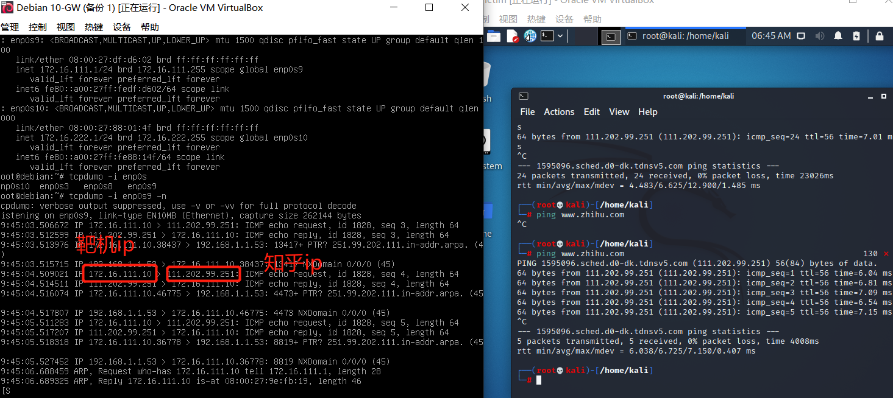

关闭`debian-gw`后，所有靶机均不可访问网络
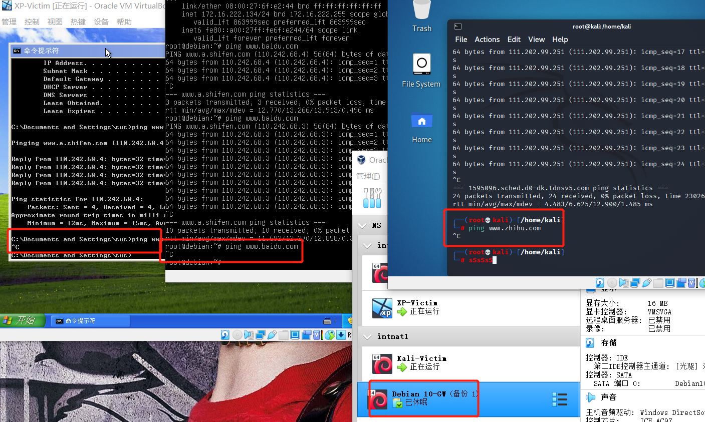

如上述所示，靶机的所有对外上下行流量必须经过网关

-[√] 所有节点均可以访问互联网-

- 靶机
在`debian10-gw`开启状态下均可上网：
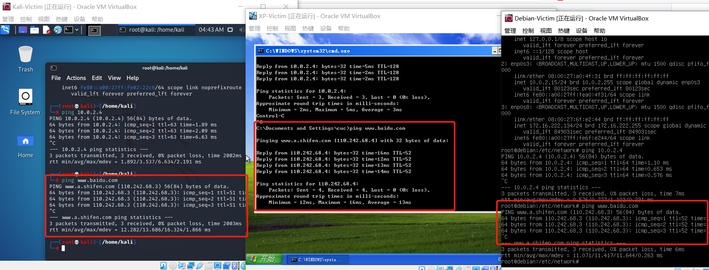

- 网关


- 攻击者

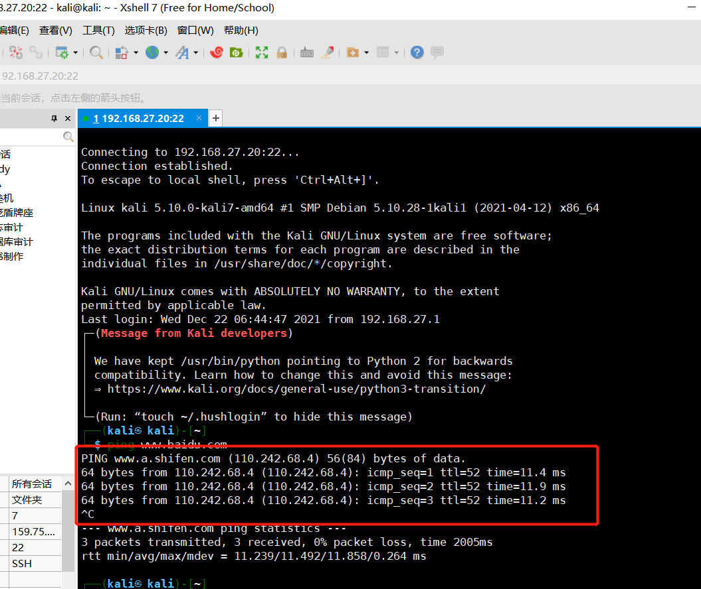


### 遇到问题

1. 配置攻击者kali和网关debian网络时，为方便主机ssh连接，最开始在Virtualbox里直接设置host-only网卡，但是登陆输入`ip add`却未显示网卡地址，dhcp未分配IP地址，最终在`/etc/network/interfaces.d`根据格式配置静态网卡ip地址，子网掩码，网关等，再重启网络就好了。

2. 配置xp网卡时，忘记在高级设置中把芯片选项改成如图所示支持的选项了，因为xp的网络控制芯片不支持1000M，须选择PCnet-Fast。
   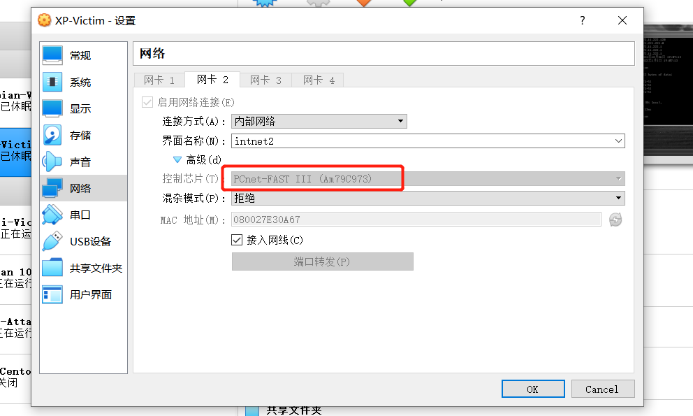

__________________________
## 课件思考题
### 以下⾏为分别破坏了CIA和AAA中哪⼀个属性或多个属性？

- 小明抄小强的作业
CIA:机密性 AAA:认证,授权
- 小明把小强的系统折腾死机了
CIA:可用性 AAA:授权 
- 小明修改了小强的淘宝订单
CIA:完整性,机密性 AAA:认证，授权
- 小明冒充小强的信用卡账单签名
CIA:完整性 AAA:认证，授权
- 小明把自⼰电脑的IP修改为小强电脑的IP，导致小强的电脑⽆法上⽹
CIA:可用性 AAA:认证，授权 


### 有⼀次，小明⼝袋里有100元，因为打瞌睡，被小偷偷⾛了，搞得晚上没饭吃。又⼀天，小明⼝袋里有200元，这次小明为了防范小偷，不打瞌睡了，但却被强盗持⼑威胁抢⾛了，搞得⼀天没饭吃，小明当天就报警了。

- 试分析两次失窃事件中的：风险、资产、威胁、弱点、攻击、影响
风险：钱被别人拿走
资产：钱
威胁：小偷，强盗或者其他人
弱点:打瞌睡导致无人看守钱,没有保护导致守护不了钱
攻击:偷、抢
影响:损失钱没饭吃

- 试用P2DR模型分析以上案例中的“现⾦被抢”事件中的安全策略、安全防护、安全检测和安全响应
第一次
安全策略：睡着，没有策略
安全防护: 找地方藏起来
安全检测: 睡着，没有检测
安全响应: 无响应
- 第二次
安全策略: 将资产藏起来,入侵检测，报警响应
安全防护: 把钱藏起来,醒着进行入侵检测
安全检测: 监视钱的完整性、机密性
安全响应: 报警

### 针对下述论点，分别设计⼀场景案例（必须和课程相关），使得该论点在该场景中成立
- 预防比检测和恢复更重要
用户密码，用户的隐私信息的机密性保护。
- 检测比预防和恢复更重要
需要司法取证的地方
- 恢复比预防和检测更重要
对重要，有意或无意被删除数据的恢复

### 试分析“CAPTCHA图片验证码技术可以阻⽌恶意批量注册⾏为”这句话中的安全策略、安全机制和安全假设分别是什么？CAPTCHA图片举例


安全策略:注册需要授权。
安全机制:设定题目辨别是否是机器人，或者冒充别人的人。
安全假设:求解出题目的人是被授权的人，回答错误的人不允许注册,机制实现是正确的。

### 某⼤型软件开发公司的总裁担⼼公司的专利软件设计⽅法被内部员⼯泄露给其他公司，他打算防⽌泄密事件的发⽣。于是他设计了这样⼀个安全机制： 所有员⼯必须每天向他汇报自⼰和其他竞争对⼿公司员⼯的所有联系(包括IM、电⼦邮件、电话等等) 。你认为该安全机制能达到总裁的预期安全效果吗？为什么？
我认为不能达到:
- 安全机制的部署和管理下，总有员工会疏忽，而且难以保证每个人都配合。
- 安全机制的集合不能够实现所有的安全策略,员工下班后可以通过很多方法泄露机密。


### 请列举你经常使用的互联⽹服务有哪些，通过公开渠道检索这些服务提供商在历史上是否经历过安全事件？据此，撰写⼀篇主题为：《某某互联⽹服务安全问题概要》的调研报告。

- www
- ssh
- ftp
- telnet