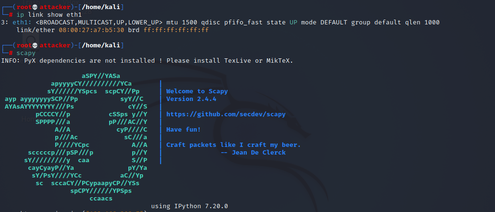
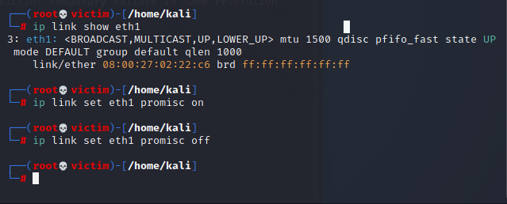
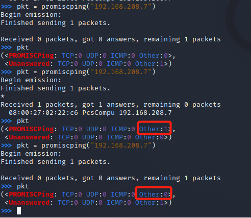

# 实验四之网络监听

## 网络拓扑


- 攻击者：kali-attacker

  ​  192.168.208.8/eth1

- 被攻击者：kali-victim

  ​  192.168.208.7/eth1


## 实验环境

- 在攻击者主机上安装scapy：

  ```
  sudo apt update && sudo apt install python3 python3-pip
  
  pip3 install scapy[complete]
  ```

## 实验一 检测局域网中的异常终端
- 在混杂模式下，网卡并不检查目的 MAC 地址，对所有的数据包都来者不拒
- 进入`scapy`


  
- 受害者网卡eth1在开启或关闭混杂模式下，攻击者使用“promiscping”构造的数据包发送给受害者


- 结果


对比前后两次“promiscping”的输出，可知，在正常模式下，只接收目的 MAC 地址的自己的数据包，其他将一律丢弃；而在混杂模式下，网卡并不检查目的 MAC 地址，对所有的数据包都来者不拒。后者就是被动监听。


## 参考资料

- [课本](https://c4pr1c3.github.io/cuc-ns/chap0x04/exp.html)


  
