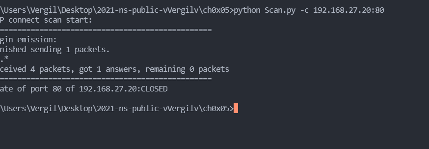
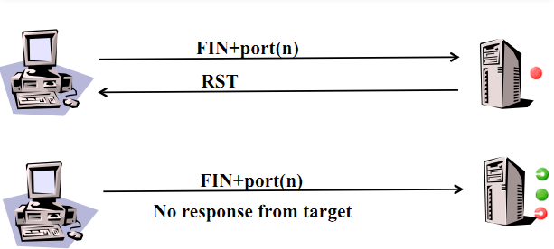

# 实验 5 ：基于 Scapy 编写端口扫描器

## 实验目的

- 掌握网络扫描之端口状态探测的基本原理

## 实验环境

- python 3.8.2 + [scapy 2.4.5](https://scapy.net/)
- 主机 win10 + 虚拟机 kali 2021.2
- ufw+apache2+nmap+dnsmasq

## 实验要求

- [x] 禁止探测互联网上的 IP ，严格遵守网络安全相关法律法规
- [x] 完成以下扫描技术的编程实现
  - TCP connect scan / TCP stealth scan
  - TCP Xmas scan / TCP fin scan / TCP null scan
  - UDP scan
- [x] 上述每种扫描技术的实现测试均需要测试端口状态为：`开放`、`关闭` 和 `过滤` 状态时的程序执行结果
- [x] 提供每一次扫描测试的抓包结果并分析与课本中的扫描方法原理是否相符？如果不同，试分析原因；
- [x] 在实验报告中详细说明实验网络环境拓扑、被测试 IP 的端口状态是如何模拟的
- （可选）复刻 `nmap` 的上述扫描技术实现的命令行参数开关

## 关于网络

拓扑图如下：


## 关于 ufw

在 kali 上安装 ufw 防火墙

开启或者关闭防火墙

```
sudo ufw enable/disable
```

建立规则 allow or deny

```
sudo ufw allow/deny 80/tcp
```

## TCP端口模拟
开启kali自带的apache2服务：


模拟端口的三个状态（开放、关闭、过滤），以 80 端口为例：


| 端口状态 |         命令          |
| :------: | :-------------------: |
|   开放   | service start apache2 |
|   关闭   | 无操作/service stop apache2  |
|   过滤   |      ufw enable       |

- 端口检查：可通过`nmap`扫描本地端口检测


## 查看端口状态

```
netstat -ntlp #查看使用tcp协议端口情况
netstat -nulp #查看使用udp协议端口情况
```

## 实验流程

### TCP 包的标志位 flags(scapy)

```
FIN = 0x01
SYN = 0x02
RST = 0x04
PSH = 0x08
ACK = 0x10
```


### TCP connect scan

#### 课本提供原理


#### 脚本代码
```py
def TCPConnect(ip, port):
    """
        目标端口是开放的：返回1.
        目标端口关闭，返回0
        目标端口没有任何响应，返回-1
        其他未考虑情况，返回-2
    """
    print('TCP connect scan start:')
    print('==================================================')
    tcp_connect_scan_resp = sr1(
        IP(dst=ip)/TCP(sport=src_port, dport=port, flags="S"), timeout=2)
    if (str(type(tcp_connect_scan_resp)) == "<class 'NoneType'>"):  # no responses的情况,端口被过滤
        return -1
    elif (tcp_connect_scan_resp.haslayer(TCP)):
        if (tcp_connect_scan_resp.getlayer(TCP).flags == 0x12):  # (SYN,ACK)
            send_rst = sr(IP(dst=ip) / TCP(sport=src_port,dport=port, flags="AR"), timeout=2)  # 回复ACK,RST
            return 1
        elif (tcp_connect_scan_resp.getlayer(TCP).flags == 0x14):  # (RST,ACK)
            return 0
    else:
        return -2
```


#### 端口开放

- 脚本输出：


- wireshark抓包结果：

可通过tsahrk命令抓包或者wireshark抓包并可视化：


  
  

#### 端口关闭

- 脚本输出结果如下：

  

- wireshark抓包结果：

  


#### 端口过滤

- 脚本输出结果：

  

- wireshark抓包结果如下：

  


**综上所示，实验模拟结果与课本原理一致**
___________________________________________________

### TCP stealth scan

#### 课本提供原理


#### 脚本代码
```py
def TcpStealthy(ip, port):
    """
        目标端口是开放的：返回1.
        目标端口关闭，返回0
        目标端口没有任何响应，返回-1
    """
    print("TCP stealth scan start:")

    stealth_scan_resp = sr1(IP(dst=ip)/TCP(sport=src_port, dport=port, flags="S"), timeout=2)
    if (str(type(stealth_scan_resp)) == "<class 'NoneType'>"):
        return -1
    elif (stealth_scan_resp.haslayer(TCP)):
        if (stealth_scan_resp.getlayer(TCP).flags == 0x12):  # (SYN,ACK)
            # 只回复RST，与connect scan的区别
            #send_rst = sr(IP(dst=ip) / TCP(sport=src_port,dport=port, flags="R"), timeout=5) 
            send(IP(dst=ip)/TCP(sport=src_port,dport=port,seq=stealth_scan_resp.ack,ack=stealth_scan_resp.seq+1,flags="R"))
            return 1
        elif (stealth_scan_resp.getlayer(TCP).flags == 0x14):  # (RST,ACK)
            return 0
    elif (stealth_scan_resp.haslayer(ICMP)):
        if (int(stealth_scan_resp.getlayer(ICMP).type) == 3 and int(stealth_scan_resp.getlayer(ICMP).code) in [1, 2, 3, 9, 10, 13]):
            return -1
```


#### 端口开放

- 脚本输出结果：

 

- wireshark抓包结果：

 

 

#### 端口关闭

- 脚本输出结果：

  

- wireshark抓包结果：

  


#### 端口过滤

- 脚本输出结果：

 

- wireshark抓包结果：

 


**综上所示，实验模拟结果与课本原理一致**
___________________________________________________
### TCP fin scan

#### 课本提供原理



#### 脚本代码
```py
def TCPFin(ip, port):
    """
       端口关闭状态，返回0
       端口开放或者过滤状态，返回1
       其他未考虑情况，返回-2
    """
    print("TCP fin scan start:")
    print('==================================================')
    fin_scan_resp = sr1(IP(dst=ip)/TCP(sport=src_port,dport=port,flags="F"),timeout=2)
    print('=================================================')

    if (str(type(fin_scan_resp))=="<class 'NoneType'>"):
        return 1
    elif(fin_scan_resp.haslayer(TCP)):
        if(fin_scan_resp.getlayer(TCP).flags == 0x14):
            return 0
    elif(fin_scan_resp.haslayer(ICMP)):
        if(int(fin_scan_resp.getlayer(ICMP).type)==3 and int(fin_scan_resp.getlayer(ICMP).code) in [1,2,3,9,10,13]):
            return 1
    else: return -2
```


- 脚本输出结果：

  

- wireshark抓包结果：


**综上所示，实验模拟结果与课本原理一致**
___________________________________________________

### TCP Xmas scan

#### 课本提供原理


#### 脚本代码
```py
def TCPXmas(ip, port):
    """
        目标端口是关闭：返回0
        目标端口开放或者过滤状态，返回1
        其他未考虑情况返回-2
    """
    print("TCP Xmas scan start:")
    print('==================================================')
    
    xmas_scan_resp = sr1(IP(dst=ip) / TCP(dport=port, flags="FPU"), timeout=2)
    if (str(type(xmas_scan_resp)) == "<class 'NoneType'>"):
        return 1
    elif (xmas_scan_resp.haslayer(TCP)):
        if (xmas_scan_resp.getlayer(TCP).flags == 0x14):# (RST,ACK)
            return 0
    elif (xmas_scan_resp.haslayer(ICMP)):
        if (int(xmas_scan_resp.getlayer(ICMP).type) == 3 and int(xmas_scan_resp.getlayer(ICMP).code) in [1, 2, 3, 9, 10,13]):
            return 1
    else:
        return -2
```

- 脚本输出结果：

  

- wireshark抓包结果：


 

  
**综上所示，实验模拟结果与课本原理一致**
___________________________________________________

### TCP null scan

#### 课本提供原理


#### 脚本代码
```py
def TCPNull(ip, port):
    """
       端口关闭状态，返回0
       端口开放或者过滤状态，返回1
       其他未考虑情况，返回-2
    """
    print("TCP null scan start:")
    print('==================================================')
    null_scan_resp = sr1(IP(dst=ip)/TCP(dport=port,flags=""),timeout=2)
    if (str(type(null_scan_resp))=="<class 'NoneType'>"):
        return 1
    elif(null_scan_resp.haslayer(TCP)):
        if(null_scan_resp.getlayer(TCP).flags == 0x14):
            return 0
    elif(null_scan_resp.haslayer(ICMP)):
        if(int(null_scan_resp.getlayer(ICMP).type)==3 and int(null_scan_resp.getlayer(ICMP).code) in [1,2,3,9,10,13]):
            return 1
```


- 脚本输出结果：

  

- wireshark抓包结果：

  
**综上所示，实验模拟结果与课本原理一致**
___________________________________________________

### UDP scan

#### 课本提供原理


#### 端口模拟
需要通过dnsmasq开启udp：53端口


-开启udp端口
```
apt install dnsmasq
systemctl start dnsmasq
```
- 关闭端口
无操作

- 过滤端口
```
ufw enable
```

#### 脚本代码
```py
def UDPScan(ip, port):
    """
        端口关闭，返回0
        端口开放状态:返回1
        端口过滤状态：返回-1
        端口过滤或者开放状态，返回-2
    """
    print("UDP scan start:")
    print('==================================================')
    
    udp_scan_resp = sr1(IP(dst=dst_ip)/UDP(dport=dst_port),timeout=dst_timeout)
    
    
    udp_scan_resp = sr1(IP(dst=ip)/UDP(sport=src_port,dport=port),timeout=2)
    print('============================================')
    
    if not udp_scan_resp:
        return -2
    if udp_scan_resp.haslayer(UDP):
        return 1
    if udp_scan_resp.haslayer(ICMP):
        if int(udp_scan_resp.getlayer(ICMP).type) ==3 and  int(udp_scan_resps.getlayer(ICMP).code)==3:
            return 0
        if int(udp_scan_resp.getlayer(ICMP).type) ==3 and  int(udp_scan_resp.getlayer(ICMP).code) in [1,2,9,10,13]:
            return -1
    else: return -2
```


- 脚本输出结果：
 

- wireshark抓包结果：
  

  

**综上所示，实验模拟结果与课本原理一致**
___________________________________________________
## 端口扫描认知


### TCP connect Scan（TCP 连接扫描）

这种方法也称之为“TCP 全连接扫描”。它是最简单的一种扫描技术，所利用的是 TCP 协议的 3 次握手过程。它直接连到目标端口并完成一个完整的 3 次握
手过程（SYN、SYN/ACK 和 ACK）。操作系统提供的“connect()”函数完成系统调用，用来与目标计算机的端口进行连接。如果端口处于侦听状态，那么“connect()”函数就能成功。否则，这个端口是不能用的，即没有提供服务。TCP 连接扫描技术的一个最大的优点是不需要任何权限，系统中的任何用户都有权利使用这个调用。另一个好处是速度快。如果对每个目标端口以线性的方式，使用单独的“connect()”函数调用，那么将会花费相当长的时间，用户可以同时打开多个套接字，从而加速扫描。使用非阻塞 I/O 允许用户设置一个低的时间以用尽周期，并同时观察多个套接字。但这种方法的缺点是很容易被发觉，并且很容易被过滤掉。目标计算机的日志文件会显示一连串的连接和连接出错的服务消息，目标计算机用户发现后就能很快使它关闭。

### TCP SYN Scan（TCP 同步序列号扫描）

若端口扫描没有完成一个完整的 TCP 连接，即在扫描主机和目标主机的一指定端口建立连接的时候，只完成前两次握手，在第三步时，扫描主机中断了本次连接，使连接没有完全建立起来，所以这种端口扫描又称为“半连接扫描”，也称为“间接扫描”或“半开式扫描”（Half Open Scan）。SYN 扫描，通过本机的一个端口向对方指定的端口，发送一个 TCP 的 SYN连接建立请求数据报，然后开始等待对方的应答。如果应答数据报中设置了 SYN位和 ACK 位，那么这个端口是开放的；如果应答数据报是一个 RST 连接复位数
据报，则对方的端口是关闭的。使用这种方法不需要完成 Connect 系统调用所封装的建立连接的整个过程，而只是完成了其中有效的部分就可以达到端口扫描的目的。此种扫描方式的优点是不容易被发现，扫描速度也比较快。同时通过对 MAC 地址的判断，可以对一些路由器进行端口扫描，缺点是需要系统管理员的权限，不适合使用多线程技术。因为在实现过程中需要自己完成对应答数据报的查找、分析，使用多线程容易发生数据报的串位现象，也就是原来应该这个线程接收的数据报被另一个线程接收，接收后，这个数据报就会被丢弃，而等待线程只好在超时之后再发送一个 SYN 数据报，等待应答。这样，所用的时间反而会增加。


### TCP FIN Scan（TCP 结束标志扫描）

这种扫描方式不依赖于 TCP 的 3 次握手过程，而是 TCP 连接的“FIN”（结束）位标志。原理在于 TCP 连接结束时，会向 TCP 端口发送一个设置了 FIN 位
的连接终止数据报，关闭的端口会回应一个设置了 RST 的连接复位数据报；而开放的端口则会对这种可疑的数据报不加理睬，将它丢弃。可以根据是否收到
RST 数据报来判断对方的端口是否开放。此扫描方式的优点比前两种都要隐秘，不容易被发现。该方案有两个缺点：首先，要判断对方端口是否开放必须等待超时，增加了探测时间，而且容易得出错误的结论；其次，一些系统并没有遵循规定，最典型的就是 Microsoft 公司所开发的操作系统。这些系统一旦收到这样的数据报，无论端口是否开放都会回应一个 RST 连接复位数据报，这样一来，这种扫描方案对于这类操作系统是无效的。

### TCP Xmas Tree Scan

这种方法向目标端口发送一个含有 FIN（结束）、URG（紧急）和 PUSH（弹出）标志的分组。根据 RFC793，对于所有关闭的端口，目标系统应该返回 RST标志。根据这一原理就可以判断哪些端口是开放的。

### TCP Null Scan

这种方法与上一方法原理是一样，只是发送的数据包不一样而已。本扫描方案中，是向目标端口发送一个不包含任何标志的分组。根据 RFC793，对于所有关闭的端口，目标系统也应该返回 RST 标志。

### UDP Scan（UDP 协议扫描）

在 UDP 扫描中，是往目标端口发送一个 UDP 分组。如果目标端口是以一个“ICMP port Unreachable”（ICMP 端口不可到达）消息来作为响应的，那么该端口是关闭的。相反，如果没有收到这个消息那就可以推断该端口打开着。还有就是一些特殊的 UDP 回馈，比如 SQL Server 服务器，对其 1434 号端口发送“x02”或者“x03”就能够探测得到其连接端口。由于 UDP 是无连接的不可靠协议，因此这种技巧的准确性很大程度上取决于与网络及系统资源的使用率相关的多个因素。另外，当试图扫描一个大量应用分组过滤功能的设备时，UDP 扫描将是一个非常缓慢的过程。如果要在互联网上执行 UDP 扫描，那么结果就是不可靠的。

## 问题
在TCP stealth scan中，
师哥/师姐代码未进行发送回复,实验结果导致没有RST的回复包，代码已做以下修改
```py
 #send_rst = sr(IP(dst=ip) / TCP(sport=src_port,dport=port, flags="R"), timeout=5) 
 send(IP(dst=ip)/TCP(sport=src_port,dport=port,seq=stealth_scan_resp.ack,ack=stealth_scan_resp.seq+1,flags="R"))
```

## 参考链接

- [课本](https://c4pr1c3.github.io/cuc-ns/chap0x05/main.html)
- [scapy 官方文档](https://scapy.readthedocs.io/en/latest/installation.html)
- [ufw 社区文档](https://help.ubuntu.com/community/UFW)
- [tcp 标志位详解](https://blog.csdn.net/qq_38323666/article/details/85338477)
- [18 级师哥/师姐作业](https://github.com/CUCCS/2018-NS-Public-cloud0606/blob/ns_0x05/ns_0x05/chap0x05%20%E7%BD%91%E7%BB%9C%E6%89%AB%E6%8F%8F.md)
